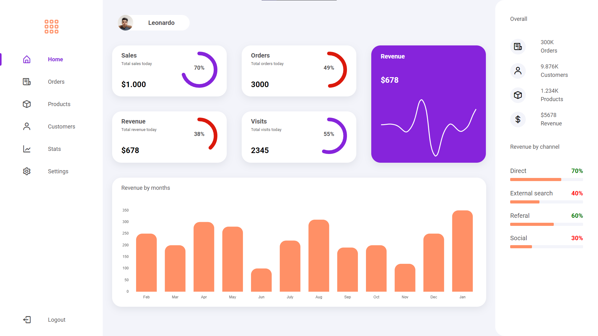

---

Projeto construido com intuito de melhorar a estruturação e organização na utilização do pré-processador SASS.




## 🚀 Construído com:

- [SASS](https://sass-lang.com/) - Pré-processador CSS.

- [React Router Dom](https://reactrouter.com/docs/en/v6/getting-started/overview) - Roteamento
- [chart.js](https://www.chartjs.org/) - Gráficos.
- [react-chartjs-2](https://react-chartjs-2.netlify.app/) - Complemento da biblioteca Chart.JS
- [Figma](https://www.figma.com/file/tZH8yyUgLGhRj1oED7wOoK/Dashboard?node-id=0%3A1) - Prototipagem.
- [Boxicons](https://boxicons.com/) - Icones.

## 🏃 Início

### ✔️ Pré-requisitos:

Você precisa do NodeJS e do NPM instalado em sua máquina.

```
yarn
yarn dev

```

## 🔖 Layout:

Você pode encontrar o arquivo [aqui](https://www.figma.com/file/tZH8yyUgLGhRj1oED7wOoK/Dashboard?node-id=0%3A1).
